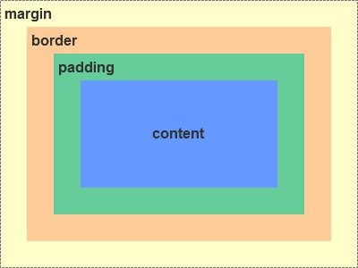
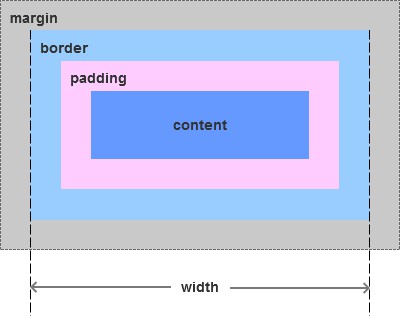
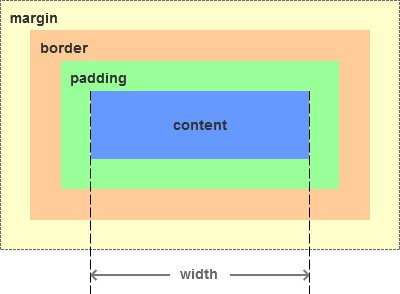
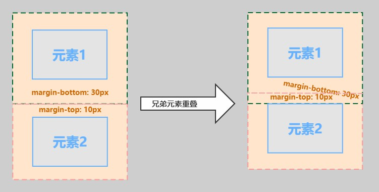
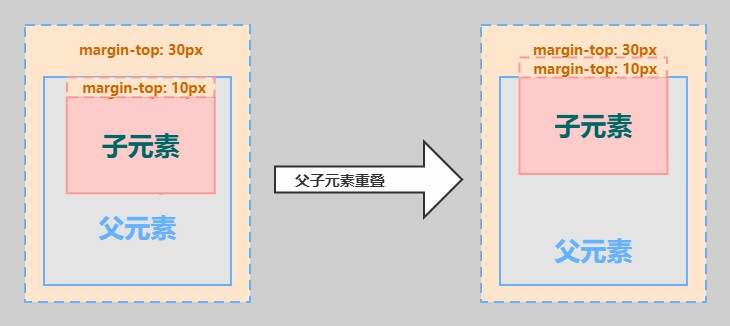

# CSS 盒模型

## 一. 什么是 CSS 盒模型?
 盒模型，顾名思义，就是一个盒子。我们可以理解为，从盒子顶部俯视所得的一个平面图，盒子里装的东西，相当于盒模型的内容（content）；东西与盒子之间的空隙，理解为盒模型的内边距（padding）；盒子本身的厚度，就是盒模型的边框（border）；盒子外与其他盒子之间的间隔，就是盒子的外边距（margin）。 

### CSS中组成一个块级盒子需要: 
* content box: 这个区域是用来显示内容，大小可以通过设置 width 和 height。
* padding box: 包围在内容区域外部的空白区域； 大小通过 padding 相关属性设置。
* border box: 边框盒包裹内容和内边距。大小通过 border 相关属性设置。
* margin box: 这是最外面的区域，是盒子和其他元素之间的空白区域，大小通过 margin 相关属性设置。

***

## 二. CSS盒模型分哪两种?
1. content box  

2. border box  

content box 盒模型的计算方式为：width/height = content  
border box 盒模型的计算方式为：width/height = content + padding + border
***
## 三. margin塌陷问题
### 1. 相邻块元素垂直外边距的合并(兄弟 margin 塌陷) 
当上下相邻的两个块元素相遇时，如果上面的元素有下外边距 margin-bottom，下面的元素有上外边距margin-top，则他们之间的垂直间距不是 margin-bottom 与 margin-top 之和，而是两者中的较大者。这种现象被称为相邻块元素垂直外边距的合并（也称外边距塌陷）但是这种合并是符合预期的。 

### 解决办法: 
* 为各个兄弟元素添加`display: inline-block;`属性

### 2. 嵌套块元素垂直外边距的合并(父子 margin 塌陷) 
   对于两个嵌套关系的块元素，必须是 block 元素。如果父元素没有上内边距 padding 、没有上边框border 、没有内容，则父元素的上外边距会与子元素的上外边距发o生合并，合并后的外边距取其较大者。即使父元素的上外边距为 0，也会发生合并。

### 解决办法: 
* 给父元素添加 padding (内边距)
* 给父元素添加 border (边框)
* 给父元素添加 `overflow: hidden;`属性(溢出隐藏)
* 给父元素添加 `display: flex;`属性